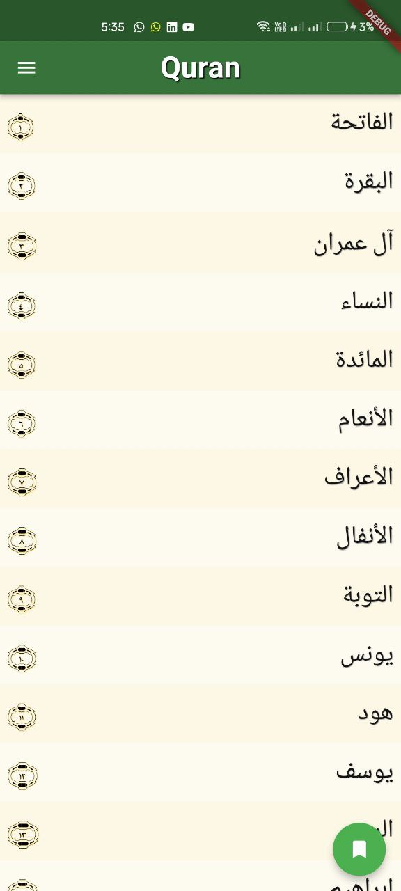
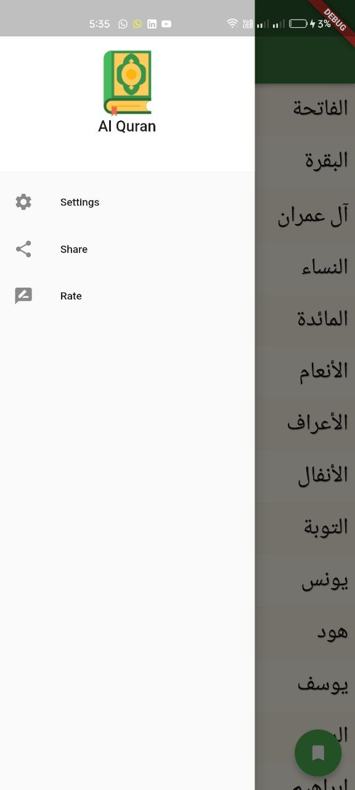
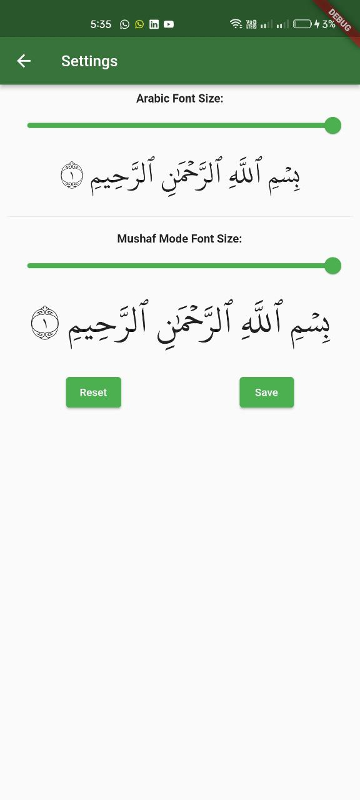

 

  
    
  </a>

<h3 align="center">El Quran ElKareem</h3>

## Snapshots

| Splash Screen | homw screen Screen                        |
|------|-------------------------------------------|
||  |

| drawer                                      | setting  Page                                |
|---------------------------------------------|----------------------------------------------|
|  |  |

| View One                                     | View Two  Page                               |
|----------------------------------------------|----------------------------------------------|
|  |  |

